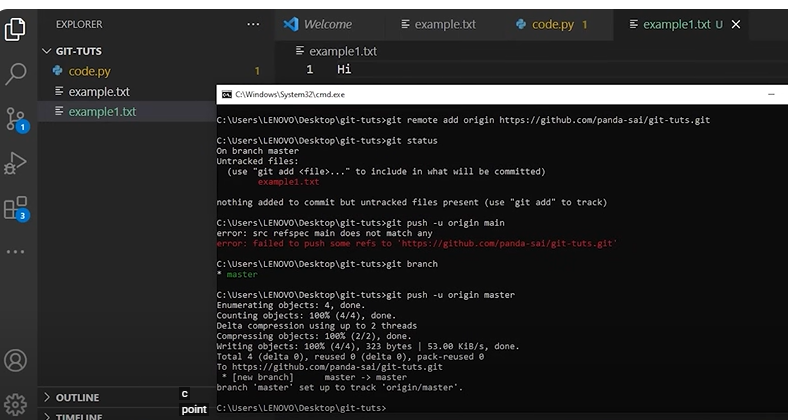

==============
# Git Vs Github
# image 1 ,2

# install git on where ever you want like linuxos/macos/windows
[refer here](https://git-scm.com/book/en/v2/Getting-Started-Installing-Git)

//*

Installing on Linux
If you want to install the basic Git tools on Linux via a binary installer, you can generally do so through the package management tool that comes with your distribution. If you’re on Fedora (or any closely-related RPM-based distribution, such as RHEL or CentOS), you can use dnf:

# $ sudo dnf install git-all
If you’re on a Debian-based distribution, such as Ubuntu, try apt:

# $ sudo apt install git-all

//*

# What does 64 and 32-bit mean?
Symptom. The terms 32-bit and 64-bit refer to the way a computer's processor (also called a CPU), handles information. The 64-bit version of Windows handles large amounts of random access memory (RAM) more effectively than a 32-bit system.

# git on windows 
# go on search >> commandprompt > terminal enter git > installed successfully > if not enter windows download again 

# concepts of git 

# Remote repo===

# repository is just a project (folder or package )
#  github / bitbucker / 

# one example of remote repo hosting service ===hosting means simply store it== (others files or folders  remote  project storing is called hosting )

eg: github /bitbukcet

# remote repo hosting services 
==
these all are hosting services 

# github is free for no of repo thats why its more popular ==as a begginner moslty use github  who is not professional 

# remote repo storing service one of example github===bitbuket / stash

# second element of git=== local repo (developing proj in our local repo)

# stagging area 
# working directory 

# note : library folder click on path remove path enter cmd it will automatically opens terminal 
# terminal === we called in mac /windows /linux
# example some folder intialising in git we use this cmd === git init == it will create .git 

# git status==== for using checking of git status === it will not executing anything just for checking status 

gitinit ===  example.txt
untRAcked SESSION file called ==WORKING DIRECTORY 

 code.py==creating a new file ==gitstatus == it will show two untracked files 
# by mistake where ever the files in local == by mistake your system is crashed === so i have to send it in remote repo ===whwenwver you want to move it in remote you should save it in local first .===so in between thisa local and  working directory middle area is stagging area it is very crucial area .

# we cant commmit only one file is not possible in working to local 
# so here stagging area comes into frame ==so we can mv whatever files we want then commit in to local repo  

example1.txt
git status

remaining all still present in working directory 
# git add for working to stagging
# git commit 

# git add code.py

# git commit -m "commiting code and example"

major advantage of commiting msg after your commits it will show the message then other person will understad the situation of thet commmit purpose .

# git remote  add origin <url>===we are saying this is your origin you have to add (we are added parent )

# git push -u origin

# Branches ====
code deploying purpose wea re using branching strategy 

# exampale: ABC project << 10 developers working on 10 different features ==creating their seperate branches based on their wrk 

In a same file multiple persons ===  same people working on one thing they will corrupt thats why they arre creaating branches ....

person1 == Hi
person2 == Hi -
person3 == Hii

main/master>>>>>>>>>>>>copy1-dev1-feature1
 >>>>>>>>>>>>>>>>>>>>>>>>copy2-dev2-feature2

>>>>>>>>>>>>>>>>>>>>>>>>>>>>copy10-dev10-feature10

# here copy is >>branch 

# pull request (PR)
# If he likes your code he will merge it if not he say some commits after that he will merge ==COMPLETE CODE WILL MV INTO MASTER .

# For make our code clear and no mistakes will get into our code that why we are using PR 

git checkout >> for jumping from one branch to another branch .

if there is no lakshmi branch  but you are using command like ===
# git checkout "lakshmi"
it says there is no branch i cant 

so i ha==should give a git command like this >> 
# git checkout -b "lakshmi"

git status
git branch 

# you are saying push into this branch but mention it cleaarly 
# git push --set-upstream origin copy1>>> this is copy of master branch so it will contain same n=master files and everything also its own content

# BUT MASTER DOESNOT having this one.txt

# present my repo im the king and minister so it directly done >>>>>>>>>> but in organisation only some of them have request acceptance >> only senior developers having permission for merging 

>>> it will mv into deploying branch 

 >>>> this is the concept of branches 

# i want  to contribute open source project >>>>arogyasetu in my repo .
# if i want to make any changes in that repo i need some permissions .but i dont have any chance for push and change becaus ehtat repo is others == in that case we have a option called fork .

# it will automatically get into our repo>>>"fork"

# so here i want to do some changes on some other forked repo  , so in that case i want to pull that repo into our local first .

# In that case just go to code >>>> HTTPS/SSH/GitHub CLI

# create a newfolder in local >>> cmd prompt>> git clone <url copies HTTPS>

# If you are pushed the repo it will not go into delhi NIC it will mv to your remote repo first ==your space >>> if you are confident then raise PR to DELHI nic >. if they like then they merge .

# issues concept is there::code contributor willl aw the all issues 

# so go on that issue and click if you know how to resolve then raise pr if they like they will accept and merge it .Like that you should contribute .

# MERGE CONFLICTS 

# I want same changes from master 
# git fetch(get the code) or git pull (also making changes)

# I will createt two branches 
# git checkout -b dev1
# git checkout -b dev2

# what commit you want

>>> in this case you should do 
# git merger origin/master

# now both will get into your master branch 

# so here first git pull >> make changes>> git add>> git commit >> merge .

# note
so now we have a master branch >>>dev1 changed and merged into branch >>>dev2 also changed and trying to merge the code into master that case will get merge conflict so you agin==ain oull the code and and add and commit then only both acceptance allowed .

